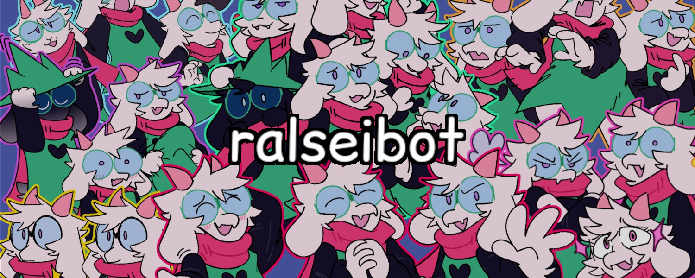

<div align="center">


<br>

A Discord Bot for all your Ralsei-related needs, built with TypeScript and Discord.js

</div>

<br>

[](https://discord.gg/mNaHqRPtKq)
[](https://discord.com/oauth2/authorize?client_id=1388252423197561013)
[](https://ralseibot.bnajns.hackclub.app)

[](LICENSE)
[](https://discord.js.org/)
[](https://www.typescriptlang.org/)
[](https://nodejs.org/)
[](https://github.com/BananaJeanss/ralseibot/stargazers)
[](https://github.com/BananaJeanss/ralseibot/actions/workflows/main.yml)
[](https://ralseibot.bnajns.hackclub.app/health)

---

## Features

- **Multi-purpose commands**: Includes a variety of commands, such as /ralsei, /dice, /ralseify, /mike, /textbox, and many more viewable via [commands.md](commands.md).
- **Basic Express Site**: Runs a basic Express site alongside the bot to display basic commands, uptime, and links.
- **Rotating Statuses**: Features a list of rotating status messages configurable via `statuses.json`
- **Content Filtering**: Filters out potentially harmful content in commands such as /ralsei
- **Ratelimits**: Per-command ratelimits to prevent spam

## List of Commands

| Command          | Description                                               |
| ---------------- | --------------------------------------------------------- |
| `/ralsei`        | Fetches a random Ralsei image from Reddit or Twitter      |
| `/ralsei-sprite` | Get a random Ralsei sprite                                |
| `/textbox`       | Generate Deltarune textboxes with custom text and sprites |
| `/ping`          | Basic responsiveness check                                |
| `/uptime`        | View bot uptime statistics                                |
| `/about`         | View information about the bot                            |

> [!NOTE]  
> More commands can be found via the discord command selector, or via [commands.md](commands.md)

## Quick Start

### Prerequisites

- [Node.js](https://nodejs.org/) v18 or higher
- [Python 3.x](https://python.org/) (optional, used in sprite extraction)
- [A Discord bot token](https://discord.com/developers/applications)
- [A Reddit app token](https://www.reddit.com/prefs/apps)

### Local Installation

1. **Clone the repository**

   ```bash
   git clone https://github.com/BananaJeanss/ralseibot.git
   cd ralseibot
   ```

2. **Install dependencies**

   ```bash
   npm install
   ```

3. **Set up environment variables**

   ```bash
   cp .env.example .env
   ```

> [!IMPORTANT]  
> Make sure to edit .env with your Discord bot token and client ID, and Reddit app client ID and secret, otherwise the bot won't work.

4. **Extract sprites** (optional for /ralsei-sprite)

   ```bash
   python -m venv .venv
   source .venv/bin/activate  # On Windows: .venv\Scripts\activate
   pip install -r src/commands/ralsei/ralsei-sprite/sprites/requirements.txt
   npm run extract-sprites
   ```

5. **Build and deploy commands**

   ```bash
   npm run build
   npm run deploy-commands
   ```

6. **Start the bot**
   ```bash
   npm start
   ```

### Configuration

#### Environment Variables

```env
# Required
DISCORD_BOT_TOKEN=your_bot_token_here
DISCORD_CLIENT_ID=your_client_id_here

# Required for Reddit handler to work (/ralsei)
REDDIT_CLIENT_ID=
REDDIT_CLIENT_SECRET=

# Optional, but recommended that you set these.
RUN_MODE=dual  # bot, site, or dual
EXPRESS_PORT=3000
```

#### Content Sources

You can configure content sources in [`sources.yaml`](sources.yaml), make sure a handler exists for it in the `handlers/` folder.

```yaml
sources:
  reddit:
    - name: "r/ralsei"
      url: "/r/ralsei/"
      weight: 5
  twitter:
    - name: "Bi-Hourly Ralsei"
      url: "https://x.com/bihourlyralsei"
      weight: 5
```

## Development

### Scripts

- `npm run dev` - Starts a development server with hot reload using tsx
- `npm run build` - Builds TypeScript to JavaScript to `dist/`
- `npm run deploy-commands` - Deploys commands in `dist/` to your Discord bot (required for commands to be accessible)
- `npm run copy-static` - Copies over static files (such as html, sprites, etc) to dist/ folder
- `npm run lint` - Runs ESLint (current config may be broken, use with caution)

### Project Structure

```
src/
├── commands/          # Discord slash commands
│   ├── ralsei/        # General/Ralsei commands
│   └── utility/       # Utility commands
├── events/            # General event handlers
├── handlers/          # Content source handlers (e.g. Reddit, Twitter)
├── site/              # Express site
└── index.ts           # Main entry point
```

## Contributing

Contributions are welcome! Please feel free to:

- Report bugs by [opening an issue](https://github.com/BananaJeanss/ralseibot/issues)
- Suggest features via the [feature request template](https://github.com/BananaJeanss/ralseibot/issues)
- Submit pull requests for improvements

Make sure your contribution follows the general guidelines, and if you're opening a pull request, that it isn't being worked on by someone else already.

For more information, read the [CONTRIBUTING.md](CONTRIBUTING.md) file.

### Contributors:

[](https://github.com/BananaJeanss/ralseibot/graphs/contributors)

## License

This project is licensed under the MIT License, see the [LICENSE](LICENSE) file for details.

## Credits

- **Sprites**: Extracted from Deltarune spritesheets via [Spriters Resource](https://www.spriters-resource.com/)
- **Hero Banner**: [@morxwx](https://x.com/morxwx) on Twitter
- **Quotes**: [HushBugger/hushbugger.github.io](https://github.com/HushBugger/hushbugger.github.io/tree/master/deltarune/text)
  for in-game quotes/text dump

Made for https://converge.hackclub.com/
